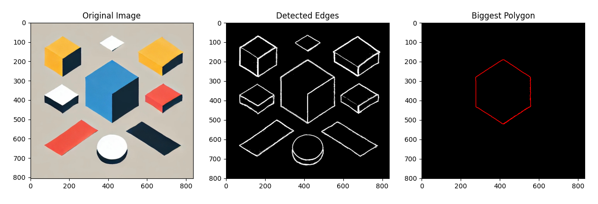

# Edge Detection and Polygon Creation in Image Processing
In this project, we are going to detect the biggest polygon in an image using Python and without OpenCV.

## Requirements

- Python 3.x
- NumPy
- Matplotlib
- Scikit-Image

You can install the required packages using pip:
```bash
pip install numpy matplotlib scikit-image
```

## Usage
Run the script:
```bash
python app.py
```

## Description
Now, we are going to explain how the steps work.

### Reading the Image
We read the sample image named `image.png` with Matplotlib.

Matplotlib reads the image and converts it to a 3-dimensional array where each dimension represents a color channel (RGB).

Channels:
- Channel at Index 0: Red
- Channel at Index 1: Green
- Channel at Index 2: Blue

### Gray Scaling
We convert the 3-channel RGB image into a 1-channel grayscale image to prepare it for edge detection. Working on a single dimension is much easier than working on a 3-dimensional image.

RGB to Grayscale Conversion Formula:
$$ 0.299 * RED + 0.587 * GREEN + 0.114 * BLUE $$

> Reversing the channels before passing the image to the converter significantly improves the quality of the final result!

### Gaussian Blurring
We apply a Gaussian filter to the grayscale image to reduce noise and detail. This step helps in detecting edges more accurately.

Gaussian Blur Formula:
$$G(x, y) = \frac{1}{2\pi\sigma^2} e^{-\frac{x^2 + y^2}{2\sigma^2}}$$

Where:
- \( G(x, y) \) is the Gaussian function.
- \( \sigma \) is the standard deviation of the Gaussian distribution.

Steps for Gaussian Blurring:
1. **Create the Gaussian Kernel**: The kernel is created using the Gaussian function.
    ```python
    kernel = np.fromfunction(
        lambda x, y: np.exp(-(x**2 + y**2) / (2 * sigma**2)) / (2 * np.pi * sigma**2),
        kernel_size
    )
    ```
2. **Normalize the Kernel**: The kernel values are normalized so that their sum is 1.
    ```python
    kernel /= np.sum(kernel)
    ```
3. **Convolve the Image**: The image is convolved with the Gaussian kernel to produce the blurred image.
    ```python
    blurred_image = convolve2d(image_gray, kernel)
    ```

### Sobel Edge Detection
We use the Sobel operator to detect edges in the image. The Sobel operator calculates the gradient magnitude of the image, highlighting regions with high spatial frequency which correspond to edges.

Sobel Edge Detection Formula:
$$G_x=\begin{bmatrix} -1 & 0 & 1 \\ -2 & 0 & 2 \\ -1 & 0 & 1 \end{bmatrix}$$
$$G_y=\begin{bmatrix} -1 & -2 & -1 \\ 0 & 0 & 0 \\ 1 & 2 & 1 \end{bmatrix}$$

Gradient Magnitude:
$$G = \sqrt{G_x^2 + G_y^2}$$

Steps for Sobel Edge Detection:
1. **Compute Gradients**: Compute the gradients in the x and y directions using the Sobel kernels \( G_x \) and \( G_y \).
    ```python
    Gx = np.array([[-1, 0, 1], [-2, 0, 2], [-1, 0, 1]])
    Gy = Gx.T
    gradient_x = convolve2d(image_gray, Gx)
    gradient_y = convolve2d(image_gray, Gy)
    ```
2. **Calculate Gradient Magnitude**: Calculate the gradient magnitude using the formula \( G = \sqrt{G_x^2 + G_y^2} \).
    ```python
    gradient_magnitude = np.sqrt(gradient_x**2 + gradient_y**2)
    ```
3. **Normalize the Gradient Magnitude**: Normalize the gradient magnitude to the range [0, 255].
    ```python
    gradient_magnitude = 255 * gradient_magnitude / np.max(gradient_magnitude)
    ```

### Thresholding
We apply a threshold to the gradient magnitude image to create a binary image where edges are highlighted.

Thresholding Formula:
$$T(x, y) = \begin{cases} 
255 & \text{if } G(x, y) > \text{threshold} \\
0 & \text{otherwise}
\end{cases}$$

Steps for Thresholding:
1. **Apply Threshold**: Convert the gradient magnitude image to a binary image based on the threshold value.
    ```python
    threshold_value = 10
    binary_image = np.where(gradient_magnitude > threshold_value, 255, 0)
    ```

### Contour Detection
We use the `find_contours` function from Scikit-Image to detect contours in the binary image. We then find the contour with the maximum number of points, which corresponds to the largest polygon.

Steps for Contour Detection:
1. **Find Contours**: Detect contours in the binary image.
    ```python
    contours = find_contours(binary_image)
    ```
2. **Find Largest Contour**: Identify the contour with the maximum number of points.
    ```python
    largest_contour = max(contours, key=len)
    ```

### Plotting the Results
We plot the original image, the detected edges, and the largest polygon on separate subplots for visualization.

Steps for Plotting:
1. **Create Subplots**: Create subplots for the original image, detected edges, and largest polygon.
    ```python
    fig, axes = plt.subplots(1, 3, figsize=(15, 8))
    ```
2. **Plot Original Image**: Display the original image.
    ```python
    axes[0].imshow(image)
    axes[0].set_title("Original Image")
    ```
3. **Plot Detected Edges**: Display the binary image with detected edges.
    ```python
    axes[1].imshow(binary_image, cmap="gray")
    axes[1].set_title("Detected Edges")
    ```
4. **Plot Largest Polygon**: Display the largest polygon on a blank canvas.
    ```python
    axes[2].imshow(np.zeros(binary_image.shape), cmap="gray")
    axes[2].plot(largest_contour[:, 1], largest_contour[:, 0], linewidth=1, color='red')
    axes[2].set_title("Biggest Polygon")
    ```
5. **Show Plot**: Display the plot.
    ```python
    plt.show()
    ```

## Result

Here is how the results look:


